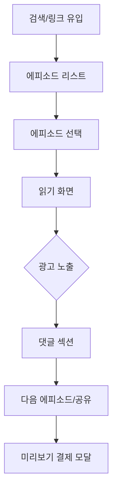

# 판타지 다이어리 UI/UX 디자인 시스템 v3.0

## Overview

모바일 퍼스트, 읽기 최적화, 광고 친화적 레이아웃을 핵심으로 하는 판타지 소설 플랫폼의 종합 디자인 시스템. SEO 친화적 구조와 접근성을 고려한 컴포넌트 기반 설계.

## Key Points

### 디자인 원칙
1. **모바일 퍼스트**: 85% 모바일 사용자 기준 설계
2. **읽기 최적화**: 장시간 독서에 적합한 타이포그래피와 레이아웃
3. **광고 자연 통합**: 콘텐츠 플로우를 방해하지 않는 광고 배치
4. **SEO 친화적**: 검색 엔진 최적화된 구조적 마크업
5. **범용 접근성**: 다양한 연령대와 능력의 사용자 고려

### 핵심 사용자 플로우


## Technical Details

### 1. 디자인 토큰 시스템

#### 색상 팔레트
```typescript
// tailwind.config.js 확장
const colors = {
  // Primary Brand Colors
  fantasy: {
    50: '#faf5ff',   // 연한 라벤더
    100: '#f3e8ff',  // 배경용
    200: '#e9d5ff',  // 카드 배경
    300: '#d8b4fe',  // 보조 요소
    400: '#c084fc',  // 액센트
    500: '#a855f7',  // 메인 브랜드
    600: '#9333ea',  // 버튼 호버
    700: '#7c2d12',  // 텍스트
    800: '#581c87',  // 다크 모드
    900: '#3b0764',  // 최대 강도
  },
  
  // Reading Colors (눈의 피로도 최소화)
  reading: {
    bg: {
      light: '#fefefe',      // 밝은 모드 배경
      dark: '#1a1a1a',       // 다크 모드 배경
      sepia: '#f4f1e8',      // 세피아 모드
    },
    text: {
      primary: '#1f2937',    // 본문 텍스트
      secondary: '#6b7280',  // 보조 텍스트
      inverse: '#f9fafb',    // 다크 모드 텍스트
    },
  },
  
  // Advertisement Colors (자연스러운 통합)
  ad: {
    bg: '#f8fafc',          // 광고 배경
    border: '#e2e8f0',      // 광고 경계
    label: '#64748b',       // 광고 라벨
  },
  
  // Semantic Colors
  success: '#10b981',
  warning: '#f59e0b',
  error: '#ef4444',
  info: '#3b82f6',
};
```

#### 타이포그래피 시스템
```typescript
const typography = {
  fontFamily: {
    // 읽기 최적화 폰트
    reading: [
      'Noto Serif KR',      // 한글 세리프 (가독성 최적화)
      'Georgia',            // 영문 세리프 백업
      'serif'
    ],
    // UI 폰트
    ui: [
      'Pretendard Variable', // 한글 최적화 산세리프
      'Inter',              // 영문 산세리프
      'sans-serif'
    ],
    // 브랜드/제목 폰트
    brand: [
      'Cinzel',             // 판타지 느낌 세리프
      'Playfair Display',   // 백업 폰트
      'serif'
    ],
  },
  
  // 읽기 최적화 폰트 크기
  fontSize: {
    // 본문 읽기용 (모바일 기준)
    'reading-xs': ['14px', { lineHeight: '24px' }],
    'reading-sm': ['16px', { lineHeight: '28px' }],
    'reading-base': ['18px', { lineHeight: '32px' }], // 기본 읽기 크기
    'reading-lg': ['20px', { lineHeight: '36px' }],
    'reading-xl': ['22px', { lineHeight: '40px' }],
    
    // UI 텍스트용
    'ui-xs': ['12px', { lineHeight: '16px' }],
    'ui-sm': ['14px', { lineHeight: '20px' }],
    'ui-base': ['16px', { lineHeight: '24px' }],
    'ui-lg': ['18px', { lineHeight: '28px' }],
    
    // 제목용
    'title-sm': ['20px', { lineHeight: '28px', letterSpacing: '-0.01em' }],
    'title-base': ['24px', { lineHeight: '32px', letterSpacing: '-0.01em' }],
    'title-lg': ['30px', { lineHeight: '36px', letterSpacing: '-0.02em' }],
    'title-xl': ['36px', { lineHeight: '40px', letterSpacing: '-0.02em' }],
  },
  
  // 읽기 환경별 설정
  readingThemes: {
    light: {
      background: colors.reading.bg.light,
      text: colors.reading.text.primary,
      contrast: '95%', // 명도 대비
    },
    dark: {
      background: colors.reading.bg.dark,
      text: colors.reading.text.inverse,
      contrast: '90%',
    },
    sepia: {
      background: colors.reading.bg.sepia,
      text: '#5d4037',
      contrast: '85%',
    },
  },
};
```

#### 간격 시스템
```typescript
const spacing = {
  // 읽기 영역용 간격
  reading: {
    paragraph: '1.5em',     // 문단 간격
    section: '2em',         // 섹션 간격
    chapter: '3em',         // 챕터 간격
  },
  
  // 광고 영역 간격
  ad: {
    margin: '24px',         // 광고와 콘텐츠 간격
    padding: '16px',        // 광고 내부 패딩
    separator: '8px',       // 광고 구분선
  },
  
  // 컴포넌트 간격 (8px 기준 스케일)
  component: {
    xs: '4px',
    sm: '8px',
    base: '16px',
    lg: '24px',
    xl: '32px',
    '2xl': '48px',
    '3xl': '64px',
  },
};
```

### 2. 핵심 컴포넌트 시스템

#### 에피소드 뷰어 (메인 컴포넌트)
```typescript
interface EpisodeViewerProps {
  episode: Episode;
  readingSettings: ReadingSettings;
  showAds: boolean;
  isPreview?: boolean;
}

// 구성 요소
const EpisodeViewer = ({ episode, readingSettings, showAds, isPreview }: EpisodeViewerProps) => {
  return (
    <div className="min-h-screen bg-reading-bg">
      {/* 읽기 헤더 - 최소한의 UI */}
      <ReadingHeader 
        title={episode.title}
        progress={readingProgress}
        onSettingsClick={() => setShowSettings(true)}
        className="sticky top-0 z-10 bg-white/90 backdrop-blur-sm"
      />
      
      {/* 메인 읽기 영역 */}
      <main className="max-w-2xl mx-auto px-4 sm:px-6">
        {/* 에피소드 헤더 */}
        <header className="py-8 border-b border-gray-200">
          <div className="text-center">
            <p className="text-ui-sm text-gray-500 mb-2">에피소드 {episode.number}</p>
            <h1 className="text-title-lg font-brand font-bold text-gray-900 mb-4">
              {episode.title}
            </h1>
            <div className="flex items-center justify-center gap-4 text-ui-sm text-gray-600">
              <span className="flex items-center gap-1">
                <Clock className="w-4 h-4" />
                {episode.estimatedReadingTime}분
              </span>
              <span className="flex items-center gap-1">
                <Eye className="w-4 h-4" />
                {episode.viewCount.toLocaleString()}회
              </span>
            </div>
          </div>
        </header>
        
        {/* 본문 */}
        <article 
          className="py-8"
          style={{
            fontSize: `${readingSettings.fontSize}px`,
            lineHeight: readingSettings.lineHeight,
            fontFamily: readingSettings.fontFamily,
          }}
        >
          <EpisodeContent 
            content={episode.content}
            showAds={showAds}
            isPreview={isPreview}
          />
        </article>
        
        {/* 광고 영역 (본문 하단) */}
        {showAds && (
          <AdUnit 
            slot="in-content-bottom"
            className="my-8"
          />
        )}
        
        {/* 에피소드 하단 액션 */}
        <EpisodeFooter 
          episode={episode}
          onShare={handleShare}
          onRate={handleRate}
        />
      </main>
      
      {/* 읽기 설정 패널 */}
      {showSettings && (
        <ReadingSettingsPanel 
          settings={readingSettings}
          onChange={updateReadingSettings}
          onClose={() => setShowSettings(false)}
        />
      )}
      
      {/* 진행도 표시 */}
      <ReadingProgressBar progress={readingProgress} />
    </div>
  );
};
```

#### 에피소드 리스트
```typescript
const EpisodeList = ({ episodes, viewMode = 'grid' }: EpisodeListProps) => {
  return (
    <div className="space-y-6">
      {/* 필터 및 정렬 */}
      <div className="flex items-center justify-between">
        <div className="flex items-center gap-2">
          <Badge variant="secondary">총 {episodes.length}편</Badge>
          <Select value={sortBy} onValueChange={setSortBy}>
            <SelectTrigger className="w-32">
              <SelectValue />
            </SelectTrigger>
            <SelectContent>
              <SelectItem value="latest">최신순</SelectItem>
              <SelectItem value="popular">인기순</SelectItem>
              <SelectItem value="rating">평점순</SelectItem>
            </SelectContent>
          </Select>
        </div>
        
        <div className="flex items-center gap-2">
          <Button
            variant={viewMode === 'grid' ? 'default' : 'ghost'}
            size="sm"
            onClick={() => setViewMode('grid')}
          >
            <Grid className="w-4 h-4" />
          </Button>
          <Button
            variant={viewMode === 'list' ? 'default' : 'ghost'}
            size="sm"
            onClick={() => setViewMode('list')}
          >
            <List className="w-4 h-4" />
          </Button>
        </div>
      </div>
      
      {/* 광고 영역 (리스트 상단) */}
      <AdUnit 
        slot="list-header"
        format="rectangle"
        className="mx-auto"
      />
      
      {/* 에피소드 그리드/리스트 */}
      <div className={cn(
        'gap-4',
        viewMode === 'grid' 
          ? 'grid grid-cols-1 sm:grid-cols-2 lg:grid-cols-3'
          : 'flex flex-col'
      )}>
        {episodes.map((episode, index) => (
          <Fragment key={episode.id}>
            <EpisodeCard 
              episode={episode}
              variant={viewMode}
            />
            
            {/* 리스트 중간 광고 (5개마다) */}
            {showAds && (index + 1) % 5 === 0 && (
              <AdUnit 
                slot="in-list"
                format="native"
                className="col-span-full"
              />
            )}
          </Fragment>
        ))}
      </div>
      
      {/* 무한 스크롤 로더 */}
      <div ref={loadMoreRef} className="flex justify-center py-8">
        {isLoading ? (
          <Spinner className="w-6 h-6" />
        ) : (
          <Button 
            variant="ghost" 
            onClick={loadMore}
            disabled={!hasMore}
          >
            {hasMore ? '더 보기' : '마지막 에피소드입니다'}
          </Button>
        )}
      </div>
    </div>
  );
};
```

#### 댓글 섹션 (회원 전용)
```typescript
const CommentSection = ({ episodeId, isAuthenticated }: CommentSectionProps) => {
  return (
    <section className="border-t border-gray-200 pt-8 mt-8">
      <div className="flex items-center justify-between mb-6">
        <h3 className="text-title-sm font-bold text-gray-900">
          독자 의견 ({comments.length})
        </h3>
        {isAuthenticated && (
          <Button 
            variant="outline" 
            size="sm"
            onClick={() => setShowCommentForm(true)}
          >
            <MessageCircle className="w-4 h-4 mr-2" />
            의견 남기기
          </Button>
        )}
      </div>
      
      {/* 댓글 작성 폼 (회원만) */}
      {isAuthenticated ? (
        <CommentForm 
          episodeId={episodeId}
          onSubmit={handleCommentSubmit}
          className="mb-6"
        />
      ) : (
        <div className="bg-gray-50 border border-gray-200 rounded-lg p-6 mb-6 text-center">
          <MessageCircle className="w-8 h-8 text-gray-400 mx-auto mb-3" />
          <p className="text-ui-base text-gray-600 mb-3">
            댓글을 작성하시려면 로그인이 필요합니다
          </p>
          <div className="flex gap-2 justify-center">
            <Button variant="outline" size="sm" onClick={() => signIn()}>
              로그인
            </Button>
            <Button variant="ghost" size="sm" onClick={() => signUp()}>
              회원가입
            </Button>
          </div>
        </div>
      )}
      
      {/* 댓글 목록 */}
      <div className="space-y-4">
        {comments.map((comment, index) => (
          <Fragment key={comment.id}>
            <CommentItem 
              comment={comment}
              canReply={isAuthenticated}
              onReply={handleReply}
            />
            
            {/* 댓글 사이 광고 (10개마다) */}
            {showAds && (index + 1) % 10 === 0 && (
              <AdUnit 
                slot="in-comments"
                format="horizontal"
                className="my-4"
              />
            )}
          </Fragment>
        ))}
      </div>
      
      {/* 댓글 더보기 */}
      {hasMoreComments && (
        <div className="text-center pt-6">
          <Button 
            variant="ghost" 
            onClick={loadMoreComments}
            disabled={isLoadingComments}
          >
            {isLoadingComments ? '로딩 중...' : '댓글 더보기'}
          </Button>
        </div>
      )}
    </section>
  );
};
```

#### 광고 통합 컴포넌트
```typescript
interface AdUnitProps {
  slot: string;
  format?: 'auto' | 'rectangle' | 'horizontal' | 'vertical' | 'native';
  className?: string;
  lazy?: boolean;
}

const AdUnit = ({ slot, format = 'auto', className, lazy = true }: AdUnitProps) => {
  const adRef = useRef<HTMLDivElement>(null);
  const [isVisible, setIsVisible] = useState(!lazy);
  
  // Intersection Observer for lazy loading
  useEffect(() => {
    if (!lazy) return;
    
    const observer = new IntersectionObserver(
      ([entry]) => {
        if (entry.isIntersecting) {
          setIsVisible(true);
          observer.disconnect();
        }
      },
      { threshold: 0.1 }
    );
    
    if (adRef.current) {
      observer.observe(adRef.current);
    }
    
    return () => observer.disconnect();
  }, [lazy]);
  
  // AdSense 초기화
  useEffect(() => {
    if (isVisible) {
      try {
        // @ts-ignore
        (window.adsbygoogle = window.adsbygoogle || []).push({});
      } catch (err) {
        console.warn('AdSense 로드 실패:', err);
      }
    }
  }, [isVisible]);
  
  if (!isVisible) {
    return (
      <div 
        ref={adRef}
        className={cn('bg-ad-bg border border-ad-border rounded-lg', className)}
        style={{ minHeight: '100px' }} // 광고 크기만큼 공간 확보
      >
        <div className="flex items-center justify-center h-full">
          <span className="text-ad-label text-ui-sm">광고</span>
        </div>
      </div>
    );
  }
  
  return (
    <div className={cn('ad-container', className)}>
      <div className="text-center mb-2">
        <span className="text-ad-label text-ui-xs uppercase tracking-wide">
          Advertisement
        </span>
      </div>
      <ins
        className="adsbygoogle"
        style={{ display: 'block' }}
        data-ad-client={process.env.NEXT_PUBLIC_ADSENSE_CLIENT_ID}
        data-ad-slot={slot}
        data-ad-format={format}
        data-full-width-responsive="true"
      />
    </div>
  );
};

// 미리 정의된 광고 슬롯
export const AdSlots = {
  HEADER_BANNER: '1234567890',
  SIDEBAR_RECTANGLE: '2345678901',
  IN_CONTENT_TOP: '3456789012',
  IN_CONTENT_BOTTOM: '4567890123',
  IN_LIST: '5678901234',
  IN_COMMENTS: '6789012345',
  FOOTER_BANNER: '7890123456',
} as const;
```

#### 미리보기 결제 모달
```typescript
interface PreviewPaymentModalProps {
  episode: Episode;
  isOpen: boolean;
  onClose: () => void;
  onSuccess: () => void;
}

const PreviewPaymentModal = ({ episode, isOpen, onClose, onSuccess }: PreviewPaymentModalProps) => {
  const [isProcessing, setIsProcessing] = useState(false);
  
  const handlePayment = async () => {
    setIsProcessing(true);
    
    try {
      // 토스페이먼츠 연동
      const response = await tossPayments.requestPayment('카드', {
        amount: 100,
        orderId: `preview_${episode.id}_${Date.now()}`,
        orderName: `${episode.title} 미리보기`,
        customerName: user?.name || '게스트',
        successUrl: `${window.location.origin}/payment/success`,
        failUrl: `${window.location.origin}/payment/fail`,
      });
      
      if (response.success) {
        onSuccess();
        toast.success('미리보기가 해제되었습니다!');
      }
    } catch (error) {
      toast.error('결제에 실패했습니다.');
    } finally {
      setIsProcessing(false);
    }
  };
  
  return (
    <Modal isOpen={isOpen} onClose={onClose} className="max-w-md">
      <div className="p-6">
        <div className="text-center mb-6">
          <div className="w-16 h-16 bg-fantasy-100 rounded-full flex items-center justify-center mx-auto mb-4">
            <Eye className="w-8 h-8 text-fantasy-500" />
          </div>
          <h2 className="text-title-base font-bold text-gray-900 mb-2">
            미리보기 해제
          </h2>
          <p className="text-ui-base text-gray-600">
            {episode.title}의 전체 내용을 읽으시겠어요?
          </p>
        </div>
        
        {/* 미리보기 정보 */}
        <div className="bg-gray-50 rounded-lg p-4 mb-6">
          <div className="flex items-center justify-between mb-2">
            <span className="text-ui-sm text-gray-600">결제 금액</span>
            <span className="text-ui-base font-semibold">100원</span>
          </div>
          <div className="flex items-center justify-between mb-2">
            <span className="text-ui-sm text-gray-600">예상 읽기 시간</span>
            <span className="text-ui-sm text-gray-800">{episode.estimatedReadingTime}분</span>
          </div>
          <div className="flex items-center justify-between">
            <span className="text-ui-sm text-gray-600">추가 내용</span>
            <span className="text-ui-sm text-gray-800">약 {episode.hiddenContentLength}자</span>
          </div>
        </div>
        
        {/* 결제 버튼 */}
        <div className="flex gap-3">
          <Button 
            variant="outline" 
            className="flex-1"
            onClick={onClose}
            disabled={isProcessing}
          >
            취소
          </Button>
          <Button 
            className="flex-1 bg-gradient-to-r from-fantasy-500 to-fantasy-600"
            onClick={handlePayment}
            disabled={isProcessing}
          >
            {isProcessing ? (
              <>
                <Spinner className="w-4 h-4 mr-2" />
                결제 중...
              </>
            ) : (
              '100원 결제하기'
            )}
          </Button>
        </div>
        
        <p className="text-ui-xs text-gray-500 text-center mt-4">
          결제는 토스페이먼츠를 통해 안전하게 처리됩니다
        </p>
      </div>
    </Modal>
  );
};
```

### 3. 모바일 최적화 레이아웃

#### 반응형 그리드 시스템
```typescript
// 모바일 우선 반응형 설정
const responsiveConfig = {
  // 컨테이너 최대 너비
  container: {
    'sm': '100%',        // 모바일
    'md': '768px',       // 태블릿
    'lg': '1024px',      // 데스크톱
    'xl': '1280px',      // 대형 데스크톱
  },
  
  // 에피소드 뷰어 너비 (읽기 최적화)
  reader: {
    'sm': '100%',        // 모바일: 전체 너비
    'md': '90%',         // 태블릿: 여백 추가
    'lg': '65ch',        // 데스크톱: 최적 읽기 너비 (65문자)
  },
  
  // 광고 배치
  ads: {
    mobile: {
      banner: '320x100',
      rectangle: '300x250',
      native: 'responsive',
    },
    tablet: {
      banner: '728x90',
      rectangle: '336x280',
      sidebar: '300x600',
    },
    desktop: {
      banner: '970x90',
      rectangle: '336x280',
      sidebar: '300x600',
      large: '970x250',
    },
  },
};
```

#### 터치 최적화 인터페이스
```typescript
const TouchOptimizedComponents = {
  // 최소 터치 영역: 44px (iOS 가이드라인)
  minTouchSize: '44px',
  
  // 제스처 지원
  gestures: {
    swipeThreshold: 50,    // px
    tapTimeout: 300,       // ms
    doubleTapTimeout: 300, // ms
  },
  
  // 스크롤 최적화
  scroll: {
    momentum: true,
    bounce: true,
    threshold: 10, // px
  },
};

// 읽기 화면 제스처 구현
const useReadingGestures = () => {
  const handleSwipe = useCallback((direction: 'left' | 'right' | 'up' | 'down') => {
    switch (direction) {
      case 'left':
        // 다음 에피소드
        navigateToNext();
        break;
      case 'right':
        // 이전 에피소드  
        navigateToPrevious();
        break;
      case 'up':
        // 스크롤 업
        window.scrollBy({ top: -window.innerHeight * 0.8, behavior: 'smooth' });
        break;
      case 'down':
        // 스크롤 다운
        window.scrollBy({ top: window.innerHeight * 0.8, behavior: 'smooth' });
        break;
    }
  }, []);
  
  return { handleSwipe };
};
```

### 4. 접근성 (A11y) 구현

#### 스크린 리더 최적화
```typescript
const AccessibilityProvider = ({ children }: { children: React.ReactNode }) => {
  return (
    <div>
      {/* 스킵 링크 */}
      <a 
        href="#main-content"
        className="sr-only focus:not-sr-only focus:absolute focus:top-4 focus:left-4 
                   bg-fantasy-600 text-white px-4 py-2 rounded-md z-50"
      >
        본문으로 건너뛰기
      </a>
      
      {/* 메인 내비게이션 */}
      <nav role="navigation" aria-label="주 내비게이션">
        <NavigationMenu />
      </nav>
      
      {/* 메인 콘텐츠 */}
      <main id="main-content" role="main" tabIndex={-1}>
        {children}
      </main>
      
      {/* 라이브 리전 (동적 업데이트 알림) */}
      <div 
        id="live-region"
        aria-live="polite"
        aria-atomic="true"
        className="sr-only"
      />
    </div>
  );
};
```

#### 키보드 내비게이션
```typescript
const KeyboardShortcuts = {
  // 전역 단축키
  global: {
    'j': '다음 에피소드',
    'k': '이전 에피소드',  
    '/': '검색',
    'h': '홈으로',
    '?': '도움말',
  },
  
  // 읽기 화면 단축키
  reading: {
    'Space': '페이지 다운',
    'Shift+Space': '페이지 업',
    'f': '전체화면',
    's': '설정',
    'c': '댓글',
  },
};

// 키보드 이벤트 핸들러
const useKeyboardShortcuts = () => {
  useEffect(() => {
    const handleKeyDown = (event: KeyboardEvent) => {
      // 입력 중일 때는 단축키 비활성화
      if (
        event.target instanceof HTMLInputElement ||
        event.target instanceof HTMLTextAreaElement ||
        event.target instanceof HTMLSelectElement
      ) {
        return;
      }
      
      switch (event.key) {
        case 'j':
          event.preventDefault();
          navigateToNext();
          announceToScreenReader('다음 에피소드로 이동합니다');
          break;
          
        case 'k':
          event.preventDefault();
          navigateToPrevious();
          announceToScreenReader('이전 에피소드로 이동합니다');
          break;
          
        case '/':
          event.preventDefault();
          focusSearchInput();
          break;
          
        case '?':
          event.preventDefault();
          showKeyboardHelp();
          break;
      }
    };
    
    document.addEventListener('keydown', handleKeyDown);
    return () => document.removeEventListener('keydown', handleKeyDown);
  }, []);
};
```

### 5. SEO 최적화 컴포넌트

#### 구조화 데이터 생성
```typescript
const StructuredData = ({ episode }: { episode: Episode }) => {
  const structuredData = {
    '@context': 'https://schema.org',
    '@type': 'Article',
    headline: episode.title,
    description: episode.summary,
    image: episode.coverImage,
    datePublished: episode.publishedAt,
    dateModified: episode.updatedAt,
    author: {
      '@type': 'Organization',
      name: '판타지 다이어리',
      url: 'https://fantasy-diary.com',
    },
    publisher: {
      '@type': 'Organization',
      name: '판타지 다이어리',
      logo: {
        '@type': 'ImageObject',
        url: 'https://fantasy-diary.com/logo.png',
      },
    },
    mainEntityOfPage: {
      '@type': 'WebPage',
      '@id': `https://fantasy-diary.com/episode/${episode.id}`,
    },
    genre: episode.genre,
    wordCount: episode.wordCount,
    timeRequired: `PT${episode.estimatedReadingTime}M`,
    audience: {
      '@type': 'Audience',
      audienceType: '판타지 소설 독자',
    },
  };
  
  return (
    <script
      type="application/ld+json"
      dangerouslySetInnerHTML={{ __html: JSON.stringify(structuredData) }}
    />
  );
};
```

#### 메타데이터 최적화
```typescript
export async function generateMetadata({ params }: { params: { episodeId: string } }) {
  const episode = await getEpisode(params.episodeId);
  
  return {
    title: `${episode.title} - 판타지 다이어리`,
    description: episode.summary,
    keywords: [
      '판타지소설',
      '무료소설', 
      '웹소설',
      episode.genre,
      ...episode.tags,
    ].join(', '),
    
    openGraph: {
      title: episode.title,
      description: episode.summary,
      type: 'article',
      publishedTime: episode.publishedAt,
      modifiedTime: episode.updatedAt,
      authors: ['판타지 다이어리'],
      section: episode.genre,
      tags: episode.tags,
      images: [{
        url: episode.coverImage,
        width: 1200,
        height: 630,
        alt: episode.title,
      }],
    },
    
    twitter: {
      card: 'summary_large_image',
      title: episode.title,
      description: episode.summary,
      images: [episode.coverImage],
    },
    
    alternates: {
      canonical: `https://fantasy-diary.com/episode/${params.episodeId}`,
    },
    
    other: {
      'article:reading_time': `${episode.estimatedReadingTime}`,
      'article:word_count': `${episode.wordCount}`,
    },
  };
}
```

## Design Patterns & Best Practices

### 컴포넌트 설계 원칙
1. **단일 책임**: 각 컴포넌트는 하나의 명확한 역할
2. **재사용성**: props를 통한 유연한 커스터마이징
3. **접근성**: ARIA 속성과 시맨틱 HTML 필수
4. **성능**: lazy loading과 코드 분할 적용
5. **테스트 가능**: 명확한 인터페이스와 순수 함수

### 상태 관리 패턴
```typescript
// 읽기 설정 상태 관리
interface ReadingSettings {
  fontSize: number;
  lineHeight: number;  
  fontFamily: string;
  theme: 'light' | 'dark' | 'sepia';
  autoScroll: boolean;
}

const useReadingSettings = () => {
  const [settings, setSettings] = useState<ReadingSettings>(() => {
    // 로컬스토리지에서 설정 로드
    if (typeof window !== 'undefined') {
      const saved = localStorage.getItem('reading-settings');
      return saved ? JSON.parse(saved) : defaultReadingSettings;
    }
    return defaultReadingSettings;
  });
  
  const updateSettings = useCallback((updates: Partial<ReadingSettings>) => {
    setSettings(prev => {
      const newSettings = { ...prev, ...updates };
      localStorage.setItem('reading-settings', JSON.stringify(newSettings));
      return newSettings;
    });
  }, []);
  
  return { settings, updateSettings };
};
```

### 에러 처리 및 로딩 상태
```typescript
const withErrorBoundary = <P extends object>(
  Component: React.ComponentType<P>,
  fallback?: React.ComponentType<{ error: Error; retry: () => void }>
) => {
  return function WithErrorBoundaryComponent(props: P) {
    return (
      <ErrorBoundary fallback={fallback}>
        <Suspense fallback={<LoadingSpinner />}>
          <Component {...props} />
        </Suspense>
      </ErrorBoundary>
    );
  };
};

// 사용 예시
const EpisodeViewerWithErrorBoundary = withErrorBoundary(
  EpisodeViewer,
  ({ error, retry }) => (
    <div className="text-center py-12">
      <p className="text-gray-600 mb-4">에피소드를 불러올 수 없습니다.</p>
      <Button onClick={retry}>다시 시도</Button>
    </div>
  )
);
```

## Performance Optimization

### 이미지 최적화
```typescript
const OptimizedImage = ({ src, alt, ...props }: ImageProps) => {
  return (
    <Image
      src={src}
      alt={alt}
      loading="lazy"
      placeholder="blur"
      blurDataURL="data:image/jpeg;base64,/9j/4AAQSkZJRgABAQAAAQABAAD..."
      sizes="(max-width: 768px) 100vw, (max-width: 1200px) 50vw, 33vw"
      {...props}
    />
  );
};
```

### 코드 분할
```typescript
// 동적 임포트로 컴포넌트 지연 로딩
const CommentSection = lazy(() => import('./CommentSection'));
const ReadingSettingsPanel = lazy(() => import('./ReadingSettingsPanel'));
const PreviewPaymentModal = lazy(() => import('./PreviewPaymentModal'));

// 라우트 기반 코드 분할
const routes = [
  {
    path: '/episode/:id',
    component: lazy(() => import('../pages/EpisodeViewer')),
  },
  {
    path: '/episodes',
    component: lazy(() => import('../pages/EpisodeList')),
  },
];
```

## Related Documents

- [[fantasy-diary-product-requirements-v2]] - 제품 요구사항
- [[fantasy-diary-technical-architecture-v2]] - 기술 아키텍처

## Lessons Learned

### 모바일 퍼스트의 중요성
- **터치 영역 최소 44px**: 엄지손가락으로 정확하게 터치할 수 있는 크기
- **읽기 최적화**: 18px 이상 폰트 크기, 1.6-1.8 줄간격으로 가독성 극대화
- **제스처 지원**: 스와이프로 페이지 이동, 핀치 줌으로 텍스트 크기 조절

### 광고 통합 전략
- **자연스러운 배치**: 콘텐츠 플로우를 방해하지 않는 위치 선택
- **지연 로딩**: Intersection Observer로 필요시에만 광고 로드
- **성능 고려**: 광고가 페이지 속도에 미치는 영향 최소화

### 접근성 구현 핵심
- **시맨틱 HTML**: div 남용 금지, 의미있는 태그 사용
- **ARIA 라벨**: 스크린 리더 사용자를 위한 명확한 설명
- **키보드 내비게이션**: 마우스 없이도 모든 기능 사용 가능