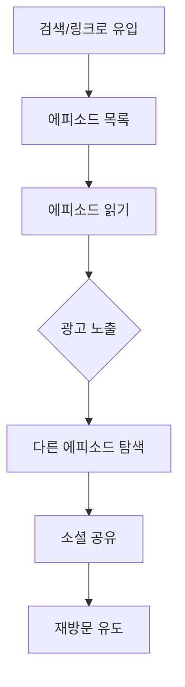
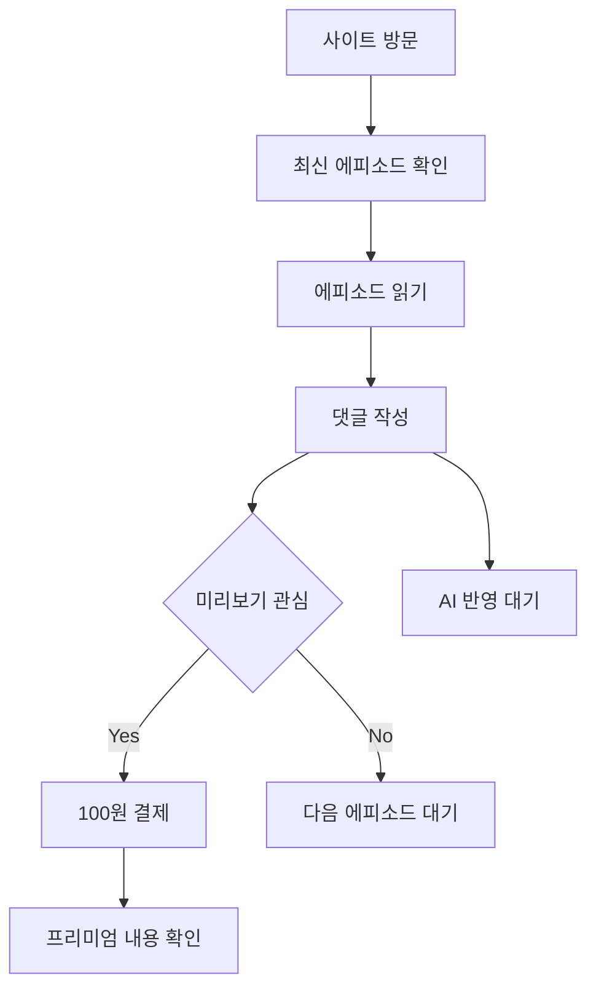

# 판타지 다이어리 서비스 기획서 v2.0 (수정됨)

## Overview

매일 5회 랜덤 시간에 자동 발행되는 AI 생성 판타지 소설 서비스. 비회원도 모든 콘텐츠 접근 가능, SEO 최적화로 검색 유입 극대화, 광고 수익 기반 비즈니스 모델. 댓글을 통한 독자 참여로 AI가 다음 에피소드에 반영하는 상호작용형 스토리텔링 플랫폼.

## Key Points

### 핵심 컨셉 변화
- **접근성**: 로그인 없이 모든 에피소드 읽기 가능 (SEO 최적화)
- **발행 방식**: 매일 5회 랜덤 발행 (최소 2시간 간격)
- **상호작용**: 댓글 내용이 AI를 통해 다음 에피소드에 반영
- **수익화**: Google AdSense 광고 + 미리보기 마이크로결제

### 발행 시스템 
**시간대별 5회 랜덤 발행**
```
시간대: 06:00~23:00 (17시간)
발행 횟수: 5회/일
간격: 최소 2시간
랜덤 범위: ±30분
```

**시간대별 테마**
- 오전(06:00-10:00): 모험 시작, 경쾌한 분위기
- 점심(10:00-14:00): 액션, 전투 시퀀스
- 오후(14:00-18:00): 로맨스, 인간관계
- 저녁(18:00-21:00): 미스터리, 반전
- 밤(21:00-23:00): 감동, 성찰, 클리맥스

### 타겟 사용자
1. **검색 유입 독자 (40%)**
   - "무료 판타지 소설" 검색으로 유입
   - 비회원으로 콘텐츠 소비
   - 광고 노출 타겟

2. **능동적 독자 (35%)**  
   - 정기적 사이트 방문
   - 댓글 참여로 스토리에 영향
   - 미리보기 결제 가능성

3. **소셜 공유 독자 (25%)**
   - SNS 공유로 유입
   - 바이럴 확산 기여
   - 커뮤니티 활동

### 비즈니스 모델
**1. 주수익: Google AdSense (80%)**
```
예상 트래픽: 일일 10,000명, 50,000 PV
AdSense RPM: ₩2,000 (업계 평균)
월 광고 수익: ₩3,600,000
```

**2. 부가수익: 미리보기 결제 (20%)**
```
가격: 100원/회
일일 결제: 150건 (PV의 0.3%)
월 결제 수익: ₩450,000
```

**총 예상 월 수익: ₩4,050,000 (6개월 목표)**

## Technical Details

### SEO 최적화 기술 구조
```typescript
// Next.js 설정 - 완전한 정적 생성
export default {
  output: 'export', // 정적 사이트 생성
  trailingSlash: true,
  images: {
    unoptimized: true // 정적 배포 최적화
  }
}

// 메타데이터 생성
export async function generateMetadata({ params }): Promise<Metadata> {
  const episode = await getEpisode(params.id)
  
  return {
    title: `${episode.title} - 판타지 다이어리`,
    description: episode.summary,
    keywords: ['판타지', '소설', '무료소설', episode.genre],
    openGraph: {
      title: episode.title,
      description: episode.summary,
      type: 'article',
      publishedTime: episode.published_at,
      authors: ['판타지 다이어리 AI']
    },
    alternates: {
      canonical: `https://fantasy-diary.com/episode/${params.id}`
    }
  }
}
```

### 랜덤 발행 시스템
```typescript
// 매일 5회 랜덤 스케줄 생성
class EpisodeScheduler {
  generateDailySchedule(): Date[] {
    const baseSlots = [
      { start: 6, end: 10 },   // 오전
      { start: 10, end: 14 },  // 점심  
      { start: 14, end: 18 },  // 오후
      { start: 18, end: 21 },  // 저녁
      { start: 21, end: 23 }   // 밤
    ]
    
    return baseSlots.map(slot => {
      const randomHour = slot.start + Math.random() * (slot.end - slot.start)
      const randomMinute = Math.random() * 60
      return new Date().setHours(Math.floor(randomHour), Math.floor(randomMinute))
    })
  }

  async scheduleEpisodes() {
    const schedule = this.generateDailySchedule()
    
    // Vercel Cron Jobs로 각 시간에 맞춰 스케줄링
    schedule.forEach((time, index) => {
      this.scheduleAt(time, () => this.generateEpisode(index))
    })
  }
}
```

### 댓글-AI 반영 시스템
```typescript
interface CommentAnalysis {
  sentiment: 'positive' | 'negative' | 'neutral'
  keywords: string[]
  suggestions: string[]
  themes: string[]
}

class CommentProcessor {
  async analyzeComments(episodeId: string): Promise<CommentAnalysis> {
    const comments = await getComments(episodeId)
    
    const prompt = `
다음 댓글들을 분석해서 다음 에피소드에 반영할 요소들을 추출해줘:

댓글들:
${comments.map(c => c.content).join('\n')}

추출할 요소:
1. 독자들이 좋아하는 캐릭터/상황
2. 더 보고 싶어하는 전개
3. 감정적 반응 (긴장, 흥미, 실망 등)
4. 구체적 제안사항
    `
    
    const analysis = await this.openai.chat.completions.create({
      model: 'gpt-4',
      messages: [{ role: 'user', content: prompt }],
      functions: [this.getAnalysisSchema()]
    })
    
    return this.parseAnalysis(analysis)
  }

  async incorporateIntoNextEpisode(analysis: CommentAnalysis, storyContext: StoryContext) {
    // 다음 에피소드 생성 시 댓글 분석 결과를 프롬프트에 포함
    const enhancedPrompt = `
기본 스토리: ${storyContext.summary}

독자 피드백 반영사항:
- 선호 요소: ${analysis.keywords.join(', ')}
- 감정 반응: ${analysis.sentiment}
- 요청 사항: ${analysis.suggestions.join(', ')}

위 피드백을 자연스럽게 반영한 다음 에피소드를 작성해주세요.
    `
    
    return await this.generateEpisode(enhancedPrompt)
  }
}
```

### 데이터베이스 스키마 수정
```sql
-- 에피소드 테이블 (비회원 접근용)
CREATE TABLE episodes (
    id UUID PRIMARY KEY DEFAULT gen_random_uuid(),
    episode_number INTEGER NOT NULL UNIQUE,
    title TEXT NOT NULL,
    content TEXT NOT NULL,
    summary TEXT NOT NULL, -- SEO용 요약
    genre TEXT NOT NULL,
    theme TEXT NOT NULL, -- 시간대별 테마
    keywords TEXT[] DEFAULT '{}', -- SEO 키워드
    published_at TIMESTAMP WITH TIME ZONE DEFAULT NOW(),
    scheduled_at TIMESTAMP WITH TIME ZONE, -- 발행 예정 시간
    view_count INTEGER DEFAULT 0,
    comment_count INTEGER DEFAULT 0,
    is_premium_preview BOOLEAN DEFAULT false, -- 미리보기 여부
    created_at TIMESTAMP WITH TIME ZONE DEFAULT NOW()
);

-- 댓글 테이블 (회원 전용)
CREATE TABLE comments (
    id UUID PRIMARY KEY DEFAULT gen_random_uuid(),
    episode_id UUID REFERENCES episodes(id) ON DELETE CASCADE,
    user_id UUID REFERENCES users(id) ON DELETE CASCADE,
    content TEXT NOT NULL,
    is_reflected BOOLEAN DEFAULT false, -- AI 반영 여부
    reflection_episode_id UUID REFERENCES episodes(id), -- 반영된 에피소드
    created_at TIMESTAMP WITH TIME ZONE DEFAULT NOW(),
    
    -- 회원만 댓글 작성 가능
    CONSTRAINT comments_user_required CHECK (user_id IS NOT NULL)
);

-- 미리보기 결제 기록
CREATE TABLE preview_purchases (
    id UUID PRIMARY KEY DEFAULT gen_random_uuid(),
    episode_id UUID REFERENCES episodes(id),
    user_identifier TEXT, -- 비회원도 가능 (세션 ID 등)
    payment_amount INTEGER DEFAULT 100,
    payment_method TEXT DEFAULT 'toss',
    purchased_at TIMESTAMP WITH TIME ZONE DEFAULT NOW()
);

-- SEO용 인덱스
CREATE INDEX idx_episodes_published_at ON episodes(published_at DESC);
CREATE INDEX idx_episodes_genre ON episodes(genre);
CREATE INDEX idx_episodes_keywords ON episodes USING gin(keywords);
```

### Google AdSense 통합
```typescript
// components/AdSense.tsx
'use client'

export function AdSenseUnit({ slot, format = 'auto' }: AdSenseProps) {
  useEffect(() => {
    try {
      // @ts-ignore
      (window.adsbygoogle = window.adsbygoogle || []).push({})
    } catch (err) {
      console.error('AdSense 로드 실패:', err)
    }
  }, [])

  return (
    <ins
      className="adsbygoogle"
      style={{ display: 'block' }}
      data-ad-client="ca-pub-YOUR_PUBLISHER_ID"
      data-ad-slot={slot}
      data-ad-format={format}
      data-full-width-responsive="true"
    />
  )
}

// 배치 전략
const AdPlacements = {
  header: 'HEADER_BANNER', // 상단 배너
  sidebar: 'SIDEBAR_300x250', // 사이드바 
  inContent: 'IN_CONTENT_NATIVE', // 글 중간 네이티브
  footer: 'FOOTER_BANNER' // 하단 배너
}
```

## Core Features & User Flow

### 1. 비회원 독자 플로우


### 2. 회원 독자 플로우  


### 3. 핵심 기능
**비회원 접근 기능**
- 모든 에피소드 읽기
- 검색 및 카테고리 필터링
- 소셜 공유
- 광고 노출 콘텐츠

**회원 전용 기능**  
- 댓글 작성/수정/삭제
- 미리보기 구매
- 개인화 추천
- 읽기 히스토리

**AI 시스템**
- 시간대별 테마 적용 자동 생성
- 댓글 분석 및 다음 에피소드 반영
- SEO 최적화 메타데이터 자동 생성
- 미리보기 스니펫 생성

## SEO Optimization Strategy

### 키워드 전략
**Primary Keywords:**
- "무료 판타지 소설"
- "온라인 소설 읽기" 
- "판타지 웹소설"
- "매일 업데이트 소설"

**Long-tail Keywords:**
- "AI가 쓴 판타지 소설"
- "무료로 읽는 판타지"
- "매일 새로운 에피소드"
- "인터랙티브 소설"

### 기술적 SEO
```typescript
// 구조화 데이터
const structuredData = {
  "@context": "https://schema.org",
  "@type": "Article",
  "headline": episode.title,
  "description": episode.summary,
  "author": {
    "@type": "Organization",
    "name": "판타지 다이어리"
  },
  "publisher": {
    "@type": "Organization", 
    "name": "판타지 다이어리",
    "logo": "https://fantasy-diary.com/logo.png"
  },
  "datePublished": episode.published_at,
  "genre": "판타지",
  "inLanguage": "ko-KR"
}

// 사이트맵 자동 생성
export async function generateSitemap() {
  const episodes = await getAllEpisodes()
  
  return episodes.map(episode => ({
    url: `https://fantasy-diary.com/episode/${episode.id}`,
    lastModified: episode.published_at,
    changeFrequency: 'never' as const,
    priority: 0.8
  }))
}
```

### 콘텐츠 최적화
- **제목**: 검색 의도 반영 + 감정적 훅
- **메타 설명**: 155자 내 핵심 스토리 요약
- **내부 링크**: 관련 에피소드 자동 연결
- **이미지 alt**: AI 생성 이미지 설명

## Revenue Projections

### 6개월 성장 예상
```
월차별 예상:
1개월: MAU 5,000 → 수익 ₩1,500,000
2개월: MAU 12,000 → 수익 ₩2,800,000  
3개월: MAU 25,000 → 수익 ₩3,600,000
6개월: MAU 50,000 → 수익 ₩4,500,000
```

### 비용 구조
```
GPT API: ₩300,000/월 (5회x30일x20원)
서버: ₩100,000/월 (Vercel Pro)
기타: ₩100,000/월
총 비용: ₩500,000/월

순이익: ₩4,000,000/월 (6개월 목표)
```

## Development Roadmap  

### Phase 1: SEO 최적화 기반 (1-2개월)
✅ **완료**
- Next.js 15 + tRPC 기본 구조
- Supabase 인증 시스템

⏳ **개발 필요**
- 완전 정적 사이트 생성 (SSG)
- 구조화 데이터 + 사이트맵
- 랜덤 발행 스케줄러
- 기본 에피소드 뷰어

### Phase 2: AI 시스템 (1개월)
- GPT API 연동 + 프롬프트 엔지니어링
- 시간대별 테마 적용
- 댓글 분석 → 에피소드 반영
- SEO 메타데이터 자동 생성

### Phase 3: 수익화 (1개월)  
- Google AdSense 통합
- 미리보기 결제 시스템 (토스페이)
- 광고 배치 최적화
- 성과 분석 대시보드

### Phase 4: 최적화 (지속)
- A/B 테스트 (광고 위치, 콘텐츠)
- SEO 성과 모니터링
- AI 품질 개선
- 사용자 피드백 반영

## Risk Assessment

### 주요 리스크
1. **SEO 경쟁**: 포화된 "무료 소설" 시장
   - 대응: 독특한 컨셉 (AI + 댓글 반영) 차별화

2. **광고 수익 변동**: AdSense 정책 변화
   - 대응: 다양한 광고 네트워크 (카카오애드, 네이버)

3. **AI 비용 증가**: GPT API 가격 인상  
   - 대응: 로컬 모델 도입, 캐싱 최적화

4. **콘텐츠 품질**: AI 생성 글의 일관성
   - 대응: 정교한 프롬프트 + 후처리 검증

### 성공 지표
```
핵심 KPI:
- 검색 유입: 40% 이상
- 광고 CTR: 2% 이상  
- 댓글 작성률: 15% 이상
- 완독률: 80% 이상
- AdSense RPM: ₩2,000 이상

부가 지표:
- 미리보기 전환: 0.3% 이상
- 재방문율: 60% 이상
- 소셜 공유: 5% 이상
```

## Related Documents

- [[fantasy-diary-technical-architecture-v2]] - 수정된 기술 아키텍처
- [[fantasy-diary-seo-strategy]] - SEO 상세 전략

## Lessons Learned

### 비즈니스 모델 변화  
- **접근성이 수익성을 만든다**: 비회원 접근 허용이 광고 수익 극대화의 핵심
- **마이크로결제 > 구독**: 부담스러운 구독보다 100원 결제가 전환율 높음
- **댓글 참여가 리텐션 결정**: 상호작용 요소가 재방문율을 크게 좌우

### 기술적 인사이트
- **SSG가 SEO의 기본**: 동적 콘텐츠도 정적 생성으로 검색 최적화
- **랜덤성이 습관을 만든다**: 예측 불가능한 발행 시간이 더 자주 방문 유도  
- **AI 품질 > 기능 복잡성**: 단순하더라도 일관성 있는 스토리가 핵심