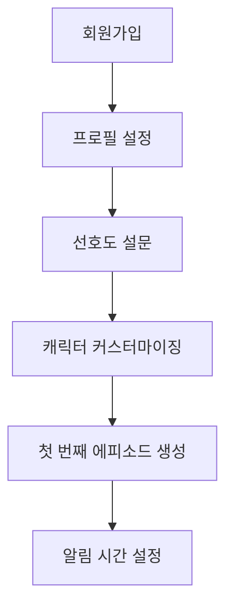
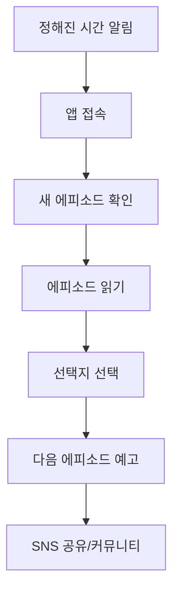

# 판타지 다이어리 서비스 기획서 (PRD)

## Overview

매일 정해진 시간에 자동으로 발행되는 AI 기반 개인 맞춤형 판타지 일기 소설 서비스. 사용자의 선택과 반응에 따라 스토리가 진화하는 인터랙티브 연재 플랫폼.

## Key Points

### 핵심 컨셉
- **일상의 판타지화**: 평범한 일상을 모험과 마법으로 변환
- **매일의 기대감**: 정해진 시간에 제공되는 새로운 에피소드
- **완전한 개인화**: AI가 사용자 취향과 선택을 학습하여 맞춤형 스토리 생성
- **습관 형성**: 독서와 상상력을 자극하는 일일 루틴 구축

### 타겟 사용자 페르소나
1. **판타지 애호가 (김소영, 24세)**
   - 웹소설/웹툰 정기 구독자
   - 개인화된 콘텐츠 선호
   - 일상의 스트레스 해소 방법 필요

2. **바쁜 직장인 (박준호, 32세)**
   - 짧은 시간 내 몰입 가능한 콘텐츠 선호
   - 출퇴근/점심시간 활용
   - 새로운 취미 활동 모색

3. **창작 활동가 (이민지, 28세)**
   - 영감과 아이디어 소스 필요
   - 스토리텔링에 관심
   - 커뮤니티 활동 적극적

### 가치 제안
- **Unique**: AI 개인화 + 매일 자동 발행의 독특한 조합
- **Convenient**: 앱 알림으로 간편한 일일 독서 습관
- **Engaging**: 사용자 선택이 스토리에 직접 영향을 주는 상호작용
- **Social**: 같은 세계관 내 다른 사용자들과의 경험 공유

## Technical Details

### 기술 스택
```typescript
// Frontend
- Next.js 15 (App Router)
- React 19
- TypeScript (strict mode)
- Tailwind CSS v4
- shadcn/ui components
- next-intl v4 (국제화)

// Backend
- tRPC v11 (API layer)
- Supabase (PostgreSQL + Auth + Realtime)
- Prisma (ORM)
- Zod (validation)

// AI & Content
- OpenAI GPT-4 Turbo
- Langchain (AI 워크플로우)
- Redis (캐싱/세션)

// Infrastructure
- Vercel (hosting)
- Supabase (database/auth)
- Upstash Redis (caching)
```

### 데이터베이스 스키마
```sql
-- 사용자 프로필
users (
  id uuid PRIMARY KEY,
  email text UNIQUE,
  username text UNIQUE,
  preferences jsonb, -- 장르, 스타일, 캐릭터 선호도
  reading_streak int DEFAULT 0,
  created_at timestamp,
  updated_at timestamp
)

-- 스토리/시리즈
stories (
  id uuid PRIMARY KEY,
  user_id uuid REFERENCES users(id),
  title text,
  world_setting jsonb, -- 세계관 설정
  character_info jsonb, -- 주인공 설정
  status text, -- active/paused/completed
  episode_count int DEFAULT 0,
  created_at timestamp
)

-- 일일 에피소드
episodes (
  id uuid PRIMARY KEY,
  story_id uuid REFERENCES stories(id),
  episode_number int,
  title text,
  content text,
  choices jsonb, -- 선택지 옵션들
  user_choice int, -- 사용자가 선택한 옵션
  published_at timestamp,
  read_at timestamp
)

-- 스토리 선택 히스토리 (AI 학습용)
story_choices (
  id uuid PRIMARY KEY,
  episode_id uuid REFERENCES episodes(id),
  choice_text text,
  selected_at timestamp
)
```

### AI 시스템 아키텍처
```typescript
// AI 스토리 생성 파이프라인
interface StoryGenerationPipeline {
  // 1. 사용자 프로필 분석
  analyzeUserPreferences(userId: string): UserProfile
  
  // 2. 이전 에피소드 컨텍스트 로드
  loadStoryContext(storyId: string): StoryContext
  
  // 3. 프롬프트 생성 및 LLM 호출
  generateEpisode(context: StoryContext, preferences: UserProfile): Episode
  
  // 4. 선택지 생성
  generateChoices(episode: Episode): Choice[]
  
  // 5. 품질 검증 및 후처리
  validateAndProcess(episode: Episode): ProcessedEpisode
}
```

## Core Features & User Flow

### 1. 온보딩 플로우


### 2. 일일 독서 플로우


### 3. 핵심 기능
- **AI 스토리 생성**: 개인화된 판타지 에피소드 자동 생성
- **선택지 시스템**: 3-4개 선택지로 스토리 방향 결정
- **캐릭터 시스템**: 주인공 외모/성격/능력 커스터마이징
- **읽기 환경**: 다크/라이트 모드, 폰트 크기, 배경음악
- **진행률 추적**: 에피소드 히스토리, 읽기 통계
- **커뮤니티**: 에피소드 리뷰, 이론/예측 토론
- **수집 요소**: 아이템, 업적, 캐릭터 성장 시스템

## Business Model & Monetization

### 수익화 전략
1. **Freemium 구독**
   - 무료: 주 3회 에피소드, 기본 선택지
   - 프리미엄 (월 9,900원): 매일 에피소드, 확장 선택지, 캐릭터 커스터마이징, 프리미엄 장르

2. **B2B 서비스**
   - 브랜디드 콘텐츠 (기업 후원 에피소드)
   - 교육기관 라이선싱 (창의적 글쓰기 교육)

3. **부가 수익**
   - 굿즈 (캐릭터 아이템, 아트북)
   - 인기 스토리 출간/웹툰 각색 라이선싱

### 예상 지표
```
MAU 목표: 1만명 (6개월), 10만명 (1년)
유료 전환율: 8-12%
ARPU: 월 7,500원
LTV/CAC 비율: 3:1 이상
```

## MVP Development Roadmap

### Phase 1: Core MVP (2-3개월)
✅ **완료된 기반 작업**
- Next.js 15 + tRPC 기본 설정
- Supabase 인증 시스템
- 국제화(next-intl) 설정

⏳ **개발 필요**
1. **AI 스토리 생성 시스템**
   - OpenAI API 연동
   - 프롬프트 엔지니어링
   - 스토리 생성 파이프라인

2. **에피소드 관리 시스템**
   - 일일 자동 발행 스케줄러
   - 에피소드 CRUD
   - 사용자별 진행률 추적

3. **기본 읽기 UI**
   - 에피소드 뷰어
   - 선택지 인터페이스
   - 다크/라이트 모드

4. **사용자 온보딩**
   - 프로필 설정
   - 선호도 설문
   - 캐릭터 기본 커스터마이징

### Phase 2: Enhancement (1-2개월)
- 커뮤니티 기능 (리뷰/토론)
- 고급 캐릭터 커스터마이징
- 읽기 환경 개선 (폰트/배경음악)
- 알림/푸시 시스템

### Phase 3: Growth (1-2개월)
- 프리미엄 구독 시스템
- 소셜 공유 기능
- 추천 시스템
- 분석 대시보드

## Technical Considerations

### 성능 최적화
- **SSG/ISR**: 에피소드 페이지 정적 생성
- **Caching**: Redis로 AI 응답/사용자 세션 캐싱
- **CDN**: 이미지/정적 에셋 최적화
- **Database**: 적절한 인덱싱, 커넥션 풀링

### 보안
- **RLS**: Supabase Row Level Security 정책
- **Rate Limiting**: AI API 호출 제한
- **Input Validation**: Zod 스키마로 모든 입력 검증
- **Content Filtering**: 부적절한 콘텐츠 필터링

### 확장성
- **Microservices**: AI 생성을 별도 서비스로 분리 고려
- **Queue System**: 에피소드 생성 작업 큐
- **Multi-region**: 글로벌 서비스 확장 대비

### A11y & UX
- **시맨틱 HTML**: 스크린 리더 호환
- **키보드 네비게이션**: 전체 앱 키보드 조작 지원
- **다국어**: 영어/일본어 확장 계획
- **반응형**: 모바일 퍼스트 디자인

## Risk Assessment

### 주요 리스크
1. **AI 콘텐츠 품질**: 일관성 없는 스토리 생성
   - 대응: 상세한 프롬프트 엔지니어링, 품질 검증 시스템

2. **사용자 유지**: 단조로운 콘텐츠로 인한 이탈
   - 대응: 다양한 장르, 개인화 알고리즘 고도화

3. **AI 비용**: OpenAI API 비용 급증
   - 대응: 캐싱 전략, 로컬 모델 도입 검토

4. **저작권**: AI 생성 콘텐츠 저작권 이슈
   - 대응: 명확한 ToS, 오리지널리티 검증 시스템

## Success Metrics

### 핵심 지표
- **DAU/MAU 비율**: 0.25 이상 (높은 일일 사용률)
- **읽기 완료율**: 에피소드당 80% 이상
- **선택 참여율**: 90% 이상 사용자가 선택지 선택
- **연속 읽기**: 평균 7일 이상 연속 사용
- **유료 전환**: 무료 사용 30일 후 10% 전환

### 부가 지표
- **커뮤니티 활동**: MAU의 30% 이상 커뮤니티 참여
- **공유율**: 에피소드당 5% 이상 SNS 공유
- **NPS**: 50 이상
- **앱스토어 평점**: 4.5 이상

## Lessons Learned

- AI 기반 콘텐츠 서비스는 **일관된 품질**과 **개인화**의 균형이 핵심
- **습관 형성**을 위한 정해진 시간 발행과 **즉석 만족**을 위한 선택지 시스템이 필수
- **커뮤니티 요소**가 있어야 장기 리텐션 가능
- **프리미엄 기능**은 편의성보다는 **콘텐츠 확장**에 집중해야 함
- **기술적 복잡성**보다는 **사용자 경험**의 완성도가 더 중요