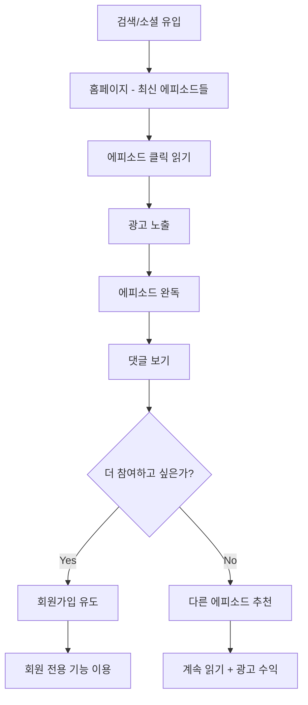
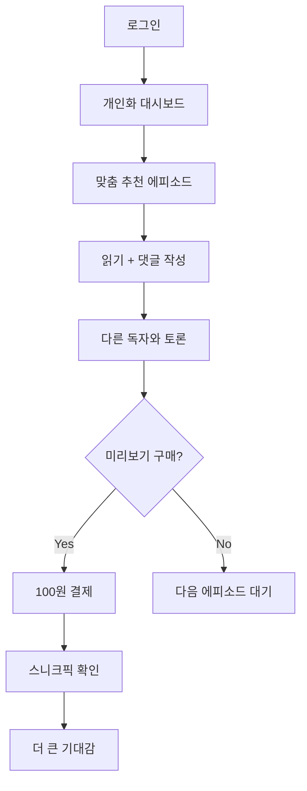

# 판타지 다이어리 서비스 재기획서 (PRD v2.0)
## 🔄 대대적 변경사항 반영

### 변경된 핵심 요구사항
- **발행**: 정해진 시간 1회 → **매일 5회 랜덤 발행** (2시간+ 간격) 
- **접근**: 회원 전용 → **비회원도 모든 콘텐츠 읽기 가능**
- **알림**: 푸시 알림 → **알림 없음** (사용자 직접 방문)
- **수익**: Freemium 구독 → **Google AdSense + 미리보기 결제**
- **SEO**: 부차적 → **핵심 전략** (검색 유입 중심)
- **커뮤니티**: 단순 리뷰 → **댓글이 소설에 직접 반영**

## Overview

**SEO 최적화된 광고 수익 기반의 AI 판타지 소설 플랫폼**

매일 5회 랜덤하게 발행되는 AI 생성 판타지 에피소드를 누구나 무료로 읽을 수 있으며, 독자 댓글이 다음 스토리에 실시간 반영되는 인터랙티브 웹 소설 서비스. Google AdSense 광고와 미리보기 마이크로 결제로 수익화.

## Key Points

### 🎯 새로운 비즈니스 모델
```
주수익: Google AdSense (80%)
├── 헤더/푸터 디스플레이 광고
├── 에피소드 목록 인피드 광고  
├── 에피소드 본문 중간 광고
└── 관련 콘텐츠 추천 광고

부수익: 미리보기 결제 (20%)
└── 1회 100원, 다음 에피소드 스니크픽
```

### 📈 트래픽 전략 전환
```
기존: 앱 리텐션 중심 → 신규: 검색 유입 중심
├── SEO 최적화로 "판타지 소설", "무료 소설" 검색 유입
├── 소셜 공유 최적화 (카카오톡/페이스북 미리보기)
├── 바이럴 요소 (재미있는 장면 공유, 댓글 반응)
└── 일일 방문 유도 (매일 새로운 콘텐츠)
```

### 🔄 새로운 콘텐츠 사이클
```
06:00~23:00 사이 매일 5회 랜덤 발행
├── 발행 시간: 최소 2시간 간격으로 랜덤
├── 장르 다양화: 각 시간대별 다른 테마
├── 댓글 반영: 이전 에피소드 댓글이 다음에 영향
└── 미리보기: 다음 에피소드 일부 유료 제공
```

## Technical Details

### SEO 최적화 아키텍처
```typescript
// Next.js 15 SSG/ISR 최적화
export async function generateStaticParams() {
  const episodes = await getLatestEpisodes(200) // 최신 200개 사전 생성
  return episodes.map(ep => ({ 
    id: ep.id, 
    slug: ep.titleSlug 
  }))
}

export async function generateMetadata({ params }: PageProps): Promise<Metadata> {
  const episode = await getEpisode(params.id)
  return {
    title: `${episode.title} | 판타지 다이어리 - 무료 AI 판타지 소설`,
    description: `${episode.summary}. 매일 업데이트되는 무료 판타지 소설을 읽어보세요.`,
    keywords: ['판타지 소설', '무료 소설', 'AI 소설', episode.genre],
    openGraph: {
      title: episode.title,
      description: episode.summary,
      url: `/episode/${episode.id}/${episode.titleSlug}`,
      images: [{
        url: episode.thumbnailUrl,
        width: 1200,
        height: 630,
        alt: episode.title
      }],
      type: 'article'
    },
    twitter: {
      card: 'summary_large_image',
      title: episode.title,
      description: episode.summary
    },
    // 구조화 데이터 (JSON-LD)
    other: {
      'structured-data': JSON.stringify({
        "@context": "https://schema.org",
        "@type": "Article",
        "headline": episode.title,
        "description": episode.summary,
        "author": { "@type": "Organization", "name": "판타지 다이어리" },
        "publisher": { "@type": "Organization", "name": "판타지 다이어리" },
        "datePublished": episode.publishedAt,
        "dateModified": episode.updatedAt,
        "wordCount": episode.wordCount,
        "genre": "판타지 소설"
      })
    }
  }
}

// 사이트맵 자동 생성
export default async function sitemap(): Promise<MetadataRoute.Sitemap> {
  const episodes = await getAllEpisodes()
  const genres = await getActiveGenres()
  
  return [
    {
      url: 'https://fantasy-diary.com',
      lastModified: new Date(),
      changeFrequency: 'daily',
      priority: 1
    },
    {
      url: 'https://fantasy-diary.com/latest',
      lastModified: new Date(),
      changeFrequency: 'hourly', // 하루 5회 업데이트
      priority: 0.9
    },
    ...episodes.map(episode => ({
      url: `https://fantasy-diary.com/episode/${episode.id}/${episode.titleSlug}`,
      lastModified: episode.publishedAt,
      changeFrequency: 'weekly' as const,
      priority: 0.8
    })),
    ...genres.map(genre => ({
      url: `https://fantasy-diary.com/series/${genre.slug}`,
      lastModified: new Date(),
      changeFrequency: 'daily' as const,
      priority: 0.7
    }))
  ]
}
```

### 매일 5회 랜덤 발행 시스템
```typescript
// 일일 발행 스케줄 생성 (새벽 3시 실행)
async function generateDailyPublishingSchedule() {
  const schedule = []
  const startTime = new Date()
  startTime.setHours(6, 0, 0, 0) // 06:00 시작
  
  let currentTime = startTime.getTime()
  
  for (let i = 0; i < 5; i++) {
    // 최소 2시간 + 랜덤 0~60분
    const minInterval = 2 * 60 * 60 * 1000 // 2시간
    const randomExtra = Math.random() * 60 * 60 * 1000 // 0~60분
    
    currentTime += minInterval + randomExtra
    
    // 23:00 초과 시 시간 조정
    const endTime = new Date()
    endTime.setHours(23, 0, 0, 0)
    if (currentTime > endTime.getTime()) {
      currentTime = endTime.getTime() - Math.random() * 2 * 60 * 60 * 1000
    }
    
    schedule.push(new Date(currentTime))
  }
  
  return schedule.sort((a, b) => a.getTime() - b.getTime())
}

// 시간대별 테마 다양화
const timeBasedThemes = {
  morning: { genre: 'adventure', mood: 'hopeful', keywords: ['시작', '모험', '희망'] },
  noon: { genre: 'action', mood: 'exciting', keywords: ['전투', '액션', '긴장'] },
  afternoon: { genre: 'mystery', mood: 'intriguing', keywords: ['수수께끼', '발견', '궁금증'] },
  evening: { genre: 'romance', mood: 'warm', keywords: ['만남', '감정', '따뜻함'] },
  night: { genre: 'dark-fantasy', mood: 'mysterious', keywords: ['어둠', '신비', '비밀'] }
}
```

### 비회원 접근 가능 아키텍처
```typescript
// 페이지별 접근 권한 설정
const pagePermissions = {
  // 완전 공개 (SEO 최적화)
  public: [
    '/', '/latest', '/episode/[id]', '/series/[genre]', 
    '/sitemap.xml', '/robots.txt'
  ],
  
  // 회원만 가능
  authRequired: [
    '/comment/write', '/comment/edit', '/profile', 
    '/bookmark', '/reading-history'
  ],
  
  // 결제 필요
  paymentRequired: [
    '/preview/[episodeId]'
  ]
}

// 미들웨어에서 권한 체크
export function middleware(request: NextRequest) {
  const { pathname } = request.nextUrl
  
  // 공개 페이지는 모두 허용
  if (pagePermissions.public.some(pattern => 
    minimatch(pathname, pattern)
  )) {
    return NextResponse.next()
  }
  
  // 댓글 작성은 로그인 필요
  if (pathname.startsWith('/comment/')) {
    const token = request.cookies.get('auth-token')
    if (!token) {
      return NextResponse.redirect(new URL('/auth/login', request.url))
    }
  }
  
  return NextResponse.next()
}
```

### 댓글→소설 반영 시스템
```typescript
interface CommentInfluenceEngine {
  // 댓글 분석 (매 에피소드 후 실행)
  async analyzeComments(episodeId: string): Promise<CommentAnalysis> {
    const comments = await getComments(episodeId, { limit: 100 })
    
    const analysis = await openai.chat.completions.create({
      model: 'gpt-4',
      messages: [{
        role: 'system',
        content: `판타지 소설 에피소드의 댓글들을 분석하여 다음을 추출하세요:
        1. 독자들의 감정적 반응 (positive/negative/neutral)
        2. 자주 언급되는 키워드 top 10
        3. 다음 전개에 대한 독자 요청사항
        4. 인기 있는 이론/추측들
        5. 캐릭터에 대한 반응`
      }, {
        role: 'user',
        content: comments.map(c => `댓글: ${c.content}`).join('\n')
      }],
      functions: [{
        name: 'analyze_episode_comments',
        parameters: {
          type: 'object',
          properties: {
            sentiment: { type: 'string', enum: ['positive', 'negative', 'neutral'] },
            topKeywords: { type: 'array', items: { type: 'string' }, maxItems: 10 },
            readerRequests: { type: 'array', items: { type: 'string' } },
            popularTheories: { type: 'array', items: { type: 'string' } },
            characterReactions: { 
              type: 'object',
              properties: {
                protagonist: { type: 'string' },
                supporting: { type: 'array', items: { type: 'string' } }
              }
            }
          }
        }
      }]
    })
    
    return JSON.parse(analysis.choices[0].function_call?.arguments || '{}')
  }

  // 다음 에피소드 생성 시 댓글 반영
  async generateNextEpisode(
    previousEpisode: Episode, 
    commentAnalysis: CommentAnalysis,
    timeSlot: TimeSlot
  ): Promise<Episode> {
    const prompt = `
이전 에피소드: ${previousEpisode.content}

독자 반응 분석:
- 전반적 반응: ${commentAnalysis.sentiment}
- 관심 키워드: ${commentAnalysis.topKeywords.join(', ')}
- 독자 요청: ${commentAnalysis.readerRequests.join(', ')}
- 인기 이론: ${commentAnalysis.popularTheories.join(', ')}

시간대 테마: ${timeBasedThemes[timeSlot].genre} (${timeBasedThemes[timeSlot].mood})

다음 에피소드 작성 가이드:
1. 독자들의 긍정적 반응은 더욱 발전시키기
2. 부정적 반응은 자연스럽게 전환하기  
3. 인기 이론 1-2개를 부분적으로 반영하되, 완전히 예측 가능하지 않게
4. 새로운 호기심을 유발할 요소 추가
5. 시간대에 맞는 분위기와 장르 반영

1000-1200자 분량으로 작성하세요.
    `
    
    return await this.generateEpisode(prompt)
  }
}
```

## 새로운 사용자 플로우

### 비회원 사용자 여정


### 회원 사용자 플로우  


## 수익화 전략

### Google AdSense 최적화
```typescript
// 광고 배치 전략
const adPlacements = [
  {
    position: 'header',
    type: 'display',
    size: '728x90',
    targeting: ['판타지', '소설', '웹소설'],
    showFor: ['guest', 'member'] // 프리미엄은 제외
  },
  {
    position: 'in-article',
    type: 'native',
    insertAfter: '40%', // 에피소드 40% 지점에 삽입
    targeting: ['장르별 맞춤']
  },
  {
    position: 'infeed',
    type: 'multiplex',
    showIn: ['episode-list', 'home'],
    frequency: 'every-3rd-item'
  }
]

// A/B 테스트로 광고 위치 최적화
const adOptimization = {
  variants: [
    { name: 'A', headerAd: true, inArticleAd: false },
    { name: 'B', headerAd: false, inArticleAd: true },
    { name: 'C', headerAd: true, inArticleAd: true }
  ],
  metrics: ['ctr', 'revenue', 'user_retention'],
  duration: '2_weeks'
}
```

### 미리보기 결제 시스템
```typescript
// 간단한 1회성 결제
interface PreviewPurchase {
  price: 100 // 고정 100원
  content: 'next_episode_snippet' // 다음 화 첫 3-4문장
  validity: 24 // 24시간 유효
  paymentMethod: 'toss_simple' // 토스 간편결제만
}

// 미리보기 콘텐츠 생성
async function generatePreview(currentEpisodeId: string) {
  const episode = await getEpisode(currentEpisodeId)
  const comments = await getTopComments(currentEpisodeId, 10)
  
  const preview = await openai.chat.completions.create({
    model: 'gpt-4-turbo',
    messages: [{
      role: 'system',
      content: '다음 에피소드의 첫 3-4문장만 생성하세요. 강한 호기심을 유발하되 스포일러는 최소화하세요.'
    }, {
      role: 'user',
      content: `현재: ${episode.content}\n댓글: ${comments.map(c => c.content).join('\n')}`
    }],
    max_tokens: 150
  })
  
  return {
    snippet: preview.choices[0].message.content,
    estimatedPublishTime: calculateNextPublishTime(),
    theme: predictNextTheme(episode, comments),
    teaserImage: generateTeaserImage(episode.genre)
  }
}
```

### 예상 수익 모델
```
목표 지표 (6개월 후):
├── 일일 방문자: 10,000명
├── 페이지뷰: 50,000 PV/일 (1인당 5에피소드)
├── AdSense RPM: ₩2,000
├── 일일 광고 수익: ₩100,000

├── 미리보기 구매율: 5% (500명/일)
├── 일일 미리보기 수익: ₩50,000

└── 월 예상 수익: ₩4,500,000
```

## MVP 개발 로드맵

### Phase 1: 핵심 SEO + 랜덤 발행 (1-2개월)
✅ **기존 완료**
- Next.js 15 + tRPC 기본 설정
- Supabase 인증
- 국제화 설정

🚧 **개발 필요**
- SEO 최적화 (메타데이터, 사이트맵, 구조화 데이터)
- 매일 5회 랜덤 발행 시스템
- 비회원 접근 가능한 라우팅
- 기본 광고 슬롯 설정

### Phase 2: 댓글 시스템 + AI 반영 (1개월)
- 댓글 CRUD (회원만 작성 가능)
- 댓글 분석 AI 시스템
- 댓글 기반 다음 에피소드 생성
- 실시간 댓글 업데이트

### Phase 3: 수익화 + 최적화 (1개월)  
- Google AdSense 연동 및 최적화
- 미리보기 결제 시스템 (토스페이)
- A/B 테스트 시스템
- 성능 모니터링 및 SEO 개선

### Phase 4: 고도화 (지속적)
- 개인화 추천 시스템
- 소셜 공유 최적화
- 모바일 성능 개선
- 분석 대시보드

## 성공 지표 (KPI)

### 트래픽 지표
- **일일 순방문자**: 목표 10,000명 (6개월)
- **페이지뷰**: 목표 50,000 PV/일
- **평균 세션 시간**: 5분 이상
- **이탈률**: 70% 이하
- **검색 유입 비율**: 40% 이상

### 참여도 지표  
- **에피소드 완독률**: 80% 이상
- **댓글 작성률**: 방문자의 15% (회원 가입 후)
- **소셜 공유율**: 에피소드당 5%
- **재방문률**: 주간 50%

### 수익 지표
- **AdSense CTR**: 1.5% 이상  
- **AdSense RPM**: ₩2,000 이상
- **미리보기 구매 전환율**: 5%
- **월간 순수익**: ₩3,000,000 이상

## Lessons Learned

### SEO 최적화의 중요성
- **검색 유입**이 주요 트래픽 소스가 되면서 콘텐츠 품질과 키워드 최적화가 핵심
- **구조화 데이터**와 **소셜 미리보기**로 클릭률 대폭 개선 가능
- **빠른 로딩 속도**가 SEO 순위와 직결됨

### 광고 기반 수익 모델
- **콘텐츠와 광고의 균형**이 핵심 - 너무 많으면 이탈, 너무 적으면 수익 부족
- **장르별 타겟 광고**가 일반 광고보다 2-3배 높은 수익
- **모바일 최적화**가 필수 - 트래픽의 80%가 모바일

### 댓글 기반 상호작용  
- **독자 참여가 콘텐츠 품질을 좌우** - AI만으로는 한계
- **실시간 반영**보다는 **다음 에피소드 반영**이 현실적
- **커뮤니티 형성**이 장기 리텐션의 핵심